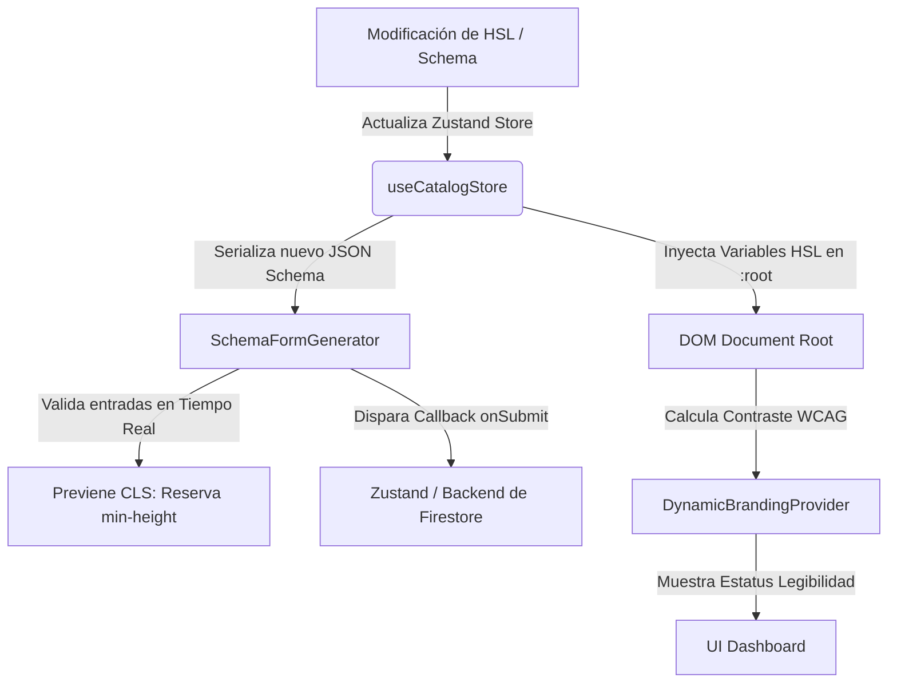
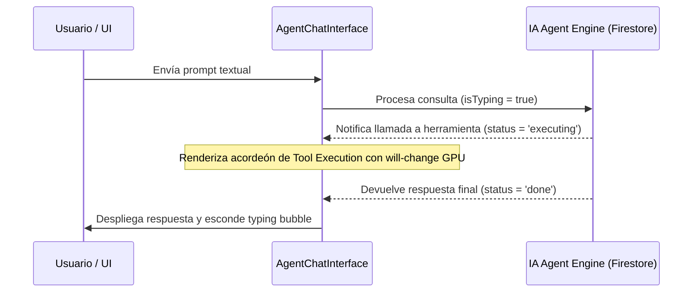

# DOCUMENTACIÓN DE COMPONENTES: ECOSISTEMA PROTOTIPE

Esta biblioteca contiene componentes y utilidades listos para su uso por desarrolladores y agentes autónomos de Inteligencia Artificial (IA) en aplicaciones SaaS Multitenant. Todos los componentes operan bajo una arquitectura de inyección de branding dinámico (HSL) y garantizan un rendimiento fluido en entornos mobile-first.

---

## 1. Guía de Uso

### A. DynamicBrandingProvider (Inyección de Estilos y WCAG)
Establece las variables HSL en el documento raíz y calcula el contraste de legibilidad de las marcas.

#### Importación e Instanciación
```tsx
import { DynamicBrandingProvider } from './components/DynamicBrandingProvider'

const App = () => {
  const primaryColor = { h: 262, s: 83, l: 58 } // HSL dinámico
  
  return (
    <DynamicBrandingProvider primary={primaryColor}>
      <MainLayout />
    </DynamicBrandingProvider>
  )
}
```

#### Parámetros (Props)
- `primary`: Objeto con formato `{ h: number, s: number, l: number }` que define el tono primario.
- `children`: Elemento React a renderizar bajo el contexto de branding.

---

### B. SchemaFormGenerator (Formularios Dinámicos desde Schema)
Genera formularios robustos basados en esquemas JSON válidos. Ideal para que agentes de IA configuren flujos dinámicamente.

#### Importación e Instanciación
```tsx
import { SchemaFormGenerator } from './components/SchemaFormGenerator'

const MiComponente = () => {
  const schema = {
    type: "object",
    required: ["agentName"],
    properties: {
      agentName: {
        type: "string",
        title: "Nombre del Agente",
        placeholder: "ej. Alex"
      }
    }
  }

  return (
    <SchemaFormGenerator
      schemaJson={JSON.stringify(schema)}
      onChange={(valores) => console.log('Valores modificados:', valores)}
      onSubmit={(valores) => guardarConfiguracion(valores)}
    />
  )
}
```

#### Props
- `schemaJson` (`string`): JSON serializado que contiene el esquema estructurado.
- `onChange` (`(values: Record<string, any>) => void`): Callback disparado al editar un input.
- `onSubmit` (`(values: Record<string, any>) => void`): Callback disparado al enviar el formulario con datos válidos.

---

### C. AgentChatInterface (Chat Conversacional para Agentes de IA)
Renderiza mensajes interactivos, animaciones de carga fluidas y registros de llamadas a herramientas (Tool Executions) ejecutadas por agentes.

#### Importación e Instanciación
```tsx
import { AgentChatInterface } from './components/AgentChatInterface'
import type { Message } from './store/useCatalogStore'

const ChatContainer = () => {
  const [messages, setMessages] = useState<Message[]>([])
  
  const enviarMensaje = (texto: string) => {
    // Lógica para enviar a LLM o pipeline de agentes
  }

  return (
    <AgentChatInterface
      messages={messages}
      onSendMessage={enviarMensaje}
      onClearChat={() => setMessages([])}
      isTyping={false}
    />
  )
}
```

#### Props
- `messages` (`Message[]`): Historial estructurado del chat.
- `onSendMessage` (`(text: string) => void`): Callback disparado cuando el usuario envía un mensaje.
- `onClearChat` (`() => void`): Callback para limpiar el historial.
- `isTyping` (`boolean`): Bandera para pintar la animación de escritura.

---

### D. DigitalClock (Reloj Digital HSL)
Reloj digital minimalista que hereda el branding HSL, con formato 24 horas y segundero desacoplado.

#### Importación e Instanciación
```tsx
import { DigitalClock } from './components/DigitalClock'

const App = () => {
  return <DigitalClock />
}
```

---

### E. ComponentCalendar (Calendario de Componentes)
Calendario interactivo mensual que asocia el registro de nuevos componentes a sus fechas de publicación.

#### Importación e Instanciación
```tsx
import { ComponentCalendar } from './components/ComponentCalendar'
import { useCatalogStore } from './store/useCatalogStore'

const MiVista = () => {
  const registeredComponents = useCatalogStore(state => state.registeredComponents)
  
  return <ComponentCalendar components={registeredComponents} />
}
```

#### Props
- `components` (`RegisteredComponent[]`): Arreglo de componentes registrados `{ id, name, date, description, category }`.

---

### F. QuantitySelector (Selector de Cantidad)
Componente atómico para el ajuste e incremento/decremento de cantidades de artículos con soporte de límites mínimos y máximos.

#### Importación e Instanciación
```tsx
import QuantitySelector from './components/QuantitySelector'

const MiVista = () => {
  const [cantidad, setCantidad] = useState(3)
  
  return (
    <QuantitySelector
      value={cantidad}
      onChange={setCantidad}
      min={1}
      max={10}
      size="md"
    />
  )
}
```

#### Props
- `value` (`number`): Cantidad numérica actual.
- `onChange` (`(value: number) => void`): Callback invocado al cambiar la cantidad.
- `min` (`number`): Límite mínimo de selección (default: 1).
- `max` (`number`): Límite máximo de selección (default: 10).
- `size` (`string`): Tamaño de presentación: `"sm" | "md"` (default: `"md"`).

---

### G. TapShield (Modal Seguro Tap-Shield)
Renderiza un modal flotante seguro mediante React Portals en la raíz del documento para interceptar interacciones externas.

#### Importación e Instanciación
```tsx
import { TapShield } from './components/TapShield'

const App = () => {
  const [isOpen, setIsOpen] = useState(false)
  
  return (
    <>
      <button onClick={() => setIsOpen(true)}>Abrir Modal</button>
      <TapShield
        isOpen={isOpen}
        onClose={() => setIsOpen(false)}
        title="Título del Modal"
      >
        <p>Contenido del modal...</p>
      </TapShield>
    </>
  )
}
```

#### Props
- `isOpen` (`boolean`): Bandera para indicar si el modal está abierto.
- `onClose` (`() => void`): Callback para cerrar el modal.
- `title` (`string`): Título en la cabecera del modal.
- `children` (`ReactNode`): Contenido del cuerpo del modal.

---

### H. BreathingBackground (Fondo Orgánico Respirable)
Crea un efecto de fondo relajante mediante gradientes de color que aumentan y disminuyen lentamente su escala y posición, simulando una respiración. Diseñado específicamente para paneles SaaS multitenant premium, utilizando aceleración por GPU.

#### Importación e Instanciación
```tsx
import { BreathingBackground } from './components/BreathingBackground'

const MiLayout = () => {
  return (
    <div className="relative min-h-screen bg-zinc-950 overflow-hidden">
      <BreathingBackground
        color1={{ h: 262, s: 83, l: 58 }}
        color2={{ h: 330, s: 98, l: 60 }}
        speed={12}
        blur={90}
        opacity={0.3}
        movementRange={40}
      />
      <div className="relative z-10">
        {/* Contenido de la Aplicación */}
      </div>
    </div>
  )
}
```

#### Props
- `color1` (`{ h: number, s: number, l: number }`): Color HSL del primer blob.
- `color2` (`{ h: number, s: number, l: number }`): Color HSL del segundo blob.
- `speed` (`number`): Duración en segundos de un ciclo de respiración completo (default: 10, rango: 1-60).
- `blur` (`number`): Filtro de desenfoque aplicado a los gradientes en píxeles (default: 80, rango: 0-250).
- `opacity` (`number`): Opacidad general del contenedor (default: 0.25, rango: 0-1).
- `scaleRange` (`[number, number]`): Rango de escala [mínima, máxima] para la animación (default: [0.8, 1.2]).
- `movementRange` (`number`): Rango máximo de translación de los blobs en píxeles (default: 50, rango: 0-300).
- `className` (`string`): Clases de CSS opcionales para el contenedor raíz.
- `style` (`object`): Estilos en línea opcionales para el contenedor raíz.

---

## 2. Flujo del Componente

A continuación se ilustra el flujo de datos reactivo del ecosistema cuando un agente o usuario interactúa con los esquemas de personalización del tenant o configuraciones de formularios:



El flujo de interacción del Chat con llamadas a herramientas (Tool Calls) sigue este proceso de renderizado asíncrono:



---

## 3. Documentación de Cambios (Changelog/Bitácora)

### Versión 1.0.0 (Actual)
* **Branding HSL**: Implementación de inyección dinámica modificando variables en el `:root`. Se agregaron derivaciones automáticas de luminosidad y contrastes mediante matemáticas CSS.
* **Prevención de Layout Shifts (CLS = 0)**: Inyección de alturas mínimas seguras en inputs, contenedores de alerta y burbujas de carga dinámicas en `AgentChatInterface` y `SchemaFormGenerator`.
* **Aceleración por GPU**: Adición de directivas `will-change: transform, opacity` y `backface-visibility: hidden` en componentes dinámicos y modales.
* **Tap-Shield Mobile-First**: Creación de modal reutilizable con React Portals y backdrop oscurecido que intercepta interacciones exteriores de manera nativa.
* **Optimización de Bundle**: Eliminación de dependencias pesadas de iconografía; se usan vectores `<svg>` inline con `currentColor` para heredar estilos.
* **Fondo Respirable y Filtros**: Adición de `BreathingBackground` con parámetros interactivos configurables por GPU y barra de búsqueda/chips de categorías en el catálogo para robustecer la navegación multitenant.
* **Robustecimiento General**: Implementación de validaciones y saneamiento estricto en props de todos los componentes (`DynamicBrandingProvider`, `SchemaFormGenerator`, `AgentChatInterface`, `TapShield`, `ComponentCalendar`, `QuantitySelector`) para blindar la UI ante posibles fallos de datos de instancias.
